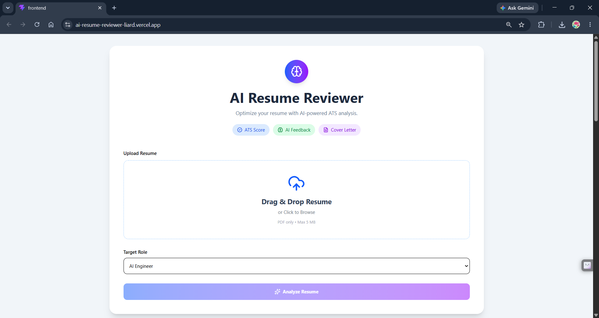
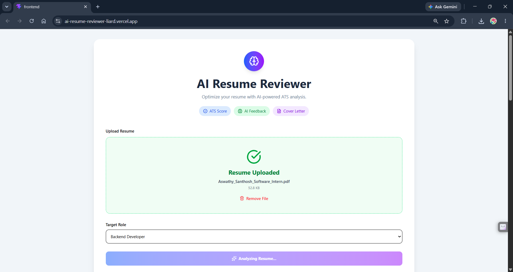
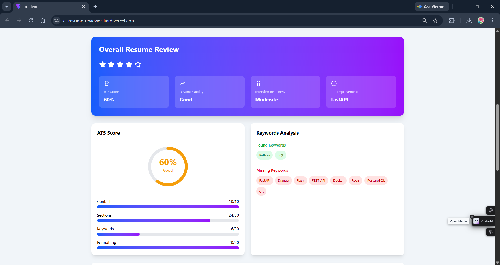
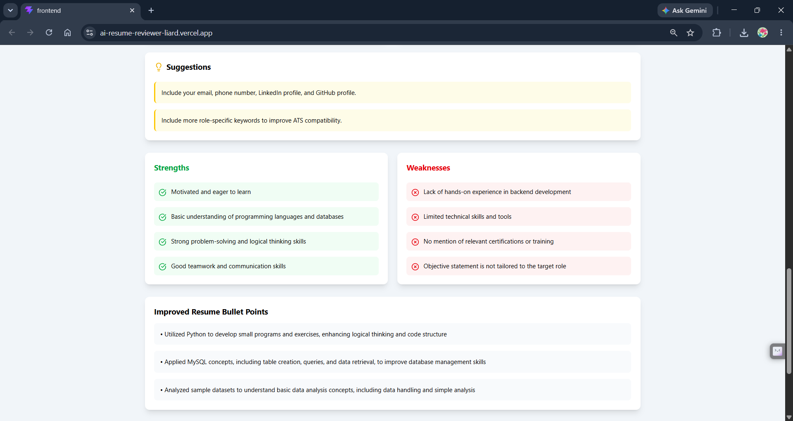
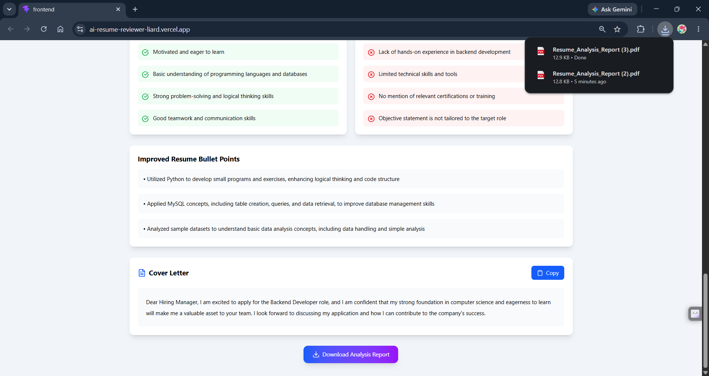

<div align="center">

# 🤖 AI Resume Reviewer

### AI-powered Resume Analysis & ATS Score Checker

Upload your resume, get an ATS score, AI-generated feedback, improved resume bullets, and a personalized cover letter—all in one application.

Built with **React + FastAPI + Groq AI + Tailwind CSS**


🌐 **Live App:** https://ai-resume-reviewer-liard.vercel.app/

🎥 **Demo Video:** https://youtu.be/zsrY7lDidv8

📄 **API Docs:** https://ai-resume-reviewer-a57t.onrender.com

</div>

---

# 📌 Overview

AI Resume Reviewer is a full-stack web application that analyzes resumes using AI and ATS-inspired heuristics. It helps job seekers improve their resumes by providing detailed feedback, resume rewriting suggestions, and AI-generated cover letters.

---

# ✨ Features

- 📄 Upload Resume (PDF)
- 📊 ATS Score Calculation
- 📝 Resume Summary
- 🤖 AI Resume Review
- 💡 Resume Improvement Suggestions
- ✍️ AI Bullet Point Rewriter
- 📩 AI Cover Letter Generator
- 📥 Download PDF Report
- ⚡ Fast API Backend
- 🎨 Modern Responsive UI

---

# 🖼️ Screenshots

```
images/
│── home.png
│── upload-success.png
│── ats-analysis.png
│── ai-feedback.png
│── cover-letter.png
```

### Home Page



---

### 📄 Resume Upload

Upload a PDF resume and choose your target role.



---

### ATS Analysis



---

### AI Feedback



---

### Cover Letter Generation



---

# 🛠️ Tech Stack

## Frontend

- React
- Vite
- Tailwind CSS
- Axios
- Lucide React

## Backend

- FastAPI
- Python
- pdfplumber
- Google GenAI / Groq API
- Pydantic

---

# 📂 Project Structure

```text
AI-RESUME-REVIEWER
│
├── frontend
│   ├── src
│   ├── public
│   └── package.json
│
├── backend
│   ├── routes
│   ├── services
│   ├── uploads
│   ├── utils
│   ├── app.py
|   ├── models.py
│   └── requirements.txt
│
└── README.md
```

---

# 🚀 Getting Started

## Clone the repository

```bash
git clone https://github.com/Aswathy486/month-01-sprint-B-projects.git
```

---

## Navigate to the project

```bash
cd month-01-sprint-B-projects/aswathysanthosh/ai-resume-reviewer
```

---

## Backend Setup

```bash
cd backend

pip install -r requirements.txt

uvicorn app:app --reload
```

---

## Frontend Setup

```bash
cd frontend

npm install

npm run dev
```

---

# 🔑 Environment Variables

Create a `.env` file inside the backend directory.

```env
GROQ_API_KEY=your_api_key
```

---

# 🌐 Deployment

🌐 Live Application

🚀 Backend deployed on Render

⚡ Frontend deployed on Vercel

---

# 📈 Future Improvements

- Resume vs Job Description Matching
- Keyword Optimization
- Multiple Resume Templates
- Resume History
- Authentication
- Multi-language Support

---


# 🤝 Contributing

Contributions are welcome!

1. Fork the repository


2. Create a feature branch

```bash
git checkout -b feature-name
```

3. Commit your changes

```bash
git commit -m "Add feature"
```

4. Push

```bash
git push origin feature-name
```

5. Open a Pull Request

---

# 📄 License

This project is licensed under the MIT License.

---

# 👩‍💻 Author

### Aswathy Santhosh

GitHub: https://github.com/Aswathy486

LinkedIn: https://www.linkedin.com/in/aswathy-santhosh-9932a5328

---

<div align="center">

⭐ If you found this project helpful, consider giving it a star!

</div>